# Mrunal Kapure
**Software Engineer | Cloud · DevOps · GenAI**

> Building systems that not only run — but run beautifully.

═══════════════════════════════════════════════

###  About Me

I’m Mrunal — a builder, optimizer, and dreamer.  
From a small village in India to the innovation labs of Arizona State University, my journey has been about transforming curiosity into impact.  
I specialize in **Cloud Infrastructure**, **Observability**, and **Generative AI**, designing systems that are resilient, scalable, and intelligent.  

═══════════════════════════════════════════════

###  My Journey

```mermaid
timeline
    title Mrunal’s Engineering Odyssey
    2015 :  Started B.E. in Computer Engineering at Mumbai University
    2019 :  Joined MSCI as an Intern → Grew into Associate SRE & DevSecOps Engineer
    2021 :  Architected CI/CD pipelines on Docker & Kubernetes, automating reliability
    2023 :  Led Climate Action Network @ MSCI, combining tech + sustainability
    2024 :  Began M.S. in Software Engineering at Arizona State University (GPA 3.89/4.0)
    2025 :  Selected as Software Engineering Intern (Observability) at Tesla
    Future :  Building the next generation of intelligent, observable systems
```

###  Featured Projects

####  SmartRCA  
A GenAI-powered web app that automates Root Cause Analysis — reducing manual effort by **80%** and improving diagnostic accuracy.

####  Cloud Cost Optimization  
Deployed spend analysis and optimization tooling that identified idle workloads and achieved **30% annual cost savings**.

####  Cloud Migration & Monitoring  
Migrated telemetry and monitoring pipelines to cloud with automated health tracking, cutting release cycles from **days to hours**.

####  Missing Person Report  
Developed a semantic web application that integrates Generative AI to summarize and refine reports — improving case analysis speed by **50%**.

═══════════════════════════════════════════════

###  Technical Toolkit

**Languages:** Python · Java · Go · Bash · SQL · JavaScript  
**Cloud & DevOps:** Azure · GCP · AWS · Docker · Kubernetes · Terraform · GitHub Actions  
**Monitoring:** Splunk · Grafana · Prometheus · Datadog · Power BI · OpsGenie · PagerDuty  

═══════════════════════════════════════════════

###  Experience

**Tesla, Inc. — Software Engineering Intern (Observability)**  
*May 2025 – Aug 2025 · Fremont, CA*  
- Automated Splunk index deployments (**95% manual effort reduced**)  
- Integrated Catchpoint performance data to improve detection accuracy  
- Built dashboards tracking 400+ monitoring nodes, accelerating incident response  

**MSCI, Inc. — Associate SRE & DevSecOps Engineer**  
*May 2019 – Aug 2024 · Mumbai, India*  
- Architected CI/CD pipelines with Docker & Kubernetes for microservices  
- Automated deployments and maintenance workflows, reclaiming **70% team capacity**  
- Built telemetry-based dashboards enabling data-driven system optimization  
- Led incident RCA initiatives across production environments  

═══════════════════════════════════════════════

###  Education

**Arizona State University**  
*M.S. in Software Engineering (Aug 2024 – May 2026)*  
📍 Tempe, AZ · GPA: **3.89/4.0**

**Mumbai University**  
*B.E. in Computer Engineering (2015 – 2019)*  

═══════════════════════════════════════════════

###  Certifications

- Microsoft Azure Fundamentals (AZ-900)  
- IT Infrastructure Library Foundation (ITIL)  

═══════════════════════════════════════════════

###  GitHub Snapshot

═══════════════════════════════════════════════

###  Let’s Connect

 [mrunal2148@gmail.com](mailto:mrunal2148@gmail.com)  
 [linkedin.com/in/mrunal-kapure](https://www.linkedin.com/in/mrunal-kapure)  
 [github.com/mrunal2148](https://github.com/mrunal2148)

═══════════════════════════════════════════════

✨ *Keep Automating. Keep Creating. Keep Dreaming.*
